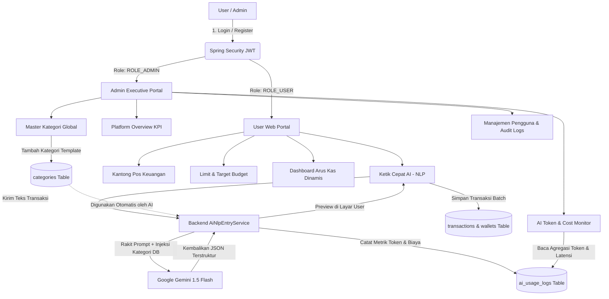

# FinancialRecord 💰
> **Enterprise-Grade AI-Powered Personal Finance & Smart Income/Expense Breakdown Platform**

FinancialRecord adalah platform manajemen keuangan modern yang berfokus pada pencatatan akurat arus **Pemasukan (Income)** dan perincian alokasi **Pengeluaran (Expense)**. Dilengkapi dengan asisten AI berbasis **Google Gemini 1.5 Flash** untuk Natural Language Processing (NLP) Quick Entry, Kantong Pos Keuangan dinamis multi-periode, Limit Budget bulanan cerdas, visualisasi Arus Kas fleksibel (Per Tahun, Per Bulan, dan Harian), serta portal Admin lengkap untuk pemantauan token AI dan tata kelola sistem.

---

## 🏛️ Arsitektur & Tech Stack

```
[ Frontend (Next.js 14/15) ] 
       ↕ (REST API + JWT Bearer Token)
[ Backend (Spring Boot 3.3.x Java 21) ]
       ↕                                  ↕
[ Google Gemini 1.5 Flash API ]    [ PostgreSQL 16 (Flyway Migrations) ]
```

### 1. Monorepo Structure
* **`/backend`**: Spring Boot 3.3.x (Java 21, Maven, Spring Security JWT, Spring Data JPA, Flyway, RestTemplate).
* **`/frontend`**: Next.js 14/15 App Router (TypeScript, TailwindCSS, Shadcn UI, TanStack Query, Lucide Icons, Recharts).
* **`/docker-compose.yml`**: PostgreSQL 16 & pgAdmin 4 Database Engine.

---

## 🔄 Alur Proses Sistem Lengkap (*End-to-End System Workflow*)

Berikut adalah penjelasan rinci mengenai bagaimana setiap fitur utama di sistem ini bekerja:



---

### 1. Alur Autentikasi & Hak Akses (RBAC)
1. **Registrasi / Login**: Pengguna memasukkan email dan password. Password dienkripsi dengan standar industri **BCrypt (10 rounds)**.
2. **Penerbitan Token**: Backend memverifikasi kredensial dan menerbitkan **JWT Access Token** (masa berlaku 24 jam).
3. **Pemisahan Hak Akses**:
   * Pengguna biasa (`ROLE_USER`) otomatis diarahkan ke User App (`/dashboard`).
   * Administrator (`ROLE_ADMIN`) memiliki akses eksklusif ke Executive Portal (`/admin/*`).

---

### 2. Alur Catat Cepat Multi-Item NLP (Google Gemini AI Engine)
Proses bagaimana kalimat santai pengguna diubah menjadi data transaksi formal:

```
[1. User Mengetik Teks Bebas]
"Beli makan siang padang 25rb, bayar bensin 50rb pake Cash, dapat transferan freelance 2.5jt"
       ⬇
[2. Backend Mengambil Konteks Pengguna]
Spring Boot mengambil daftar dompet aktif dan daftar kategori yang tersedia dari database.
       ⬇
[3. Orkestrasi Prompt ke Gemini 1.5 Flash]
Backend menyisipkan teks user, kategori DB, dan format JSON schema ke template prompt.
       ⬇
[4. AI Gemini Mengurai Data secara Semantik]
Gemini membedah kalimat multi-item dan mencocokkan kategori serta tipe arus dana (Income/Expense).
       ⬇
[5. Pencatatan Telemetri AI (AiMetricsTracker)]
Sistem mencatat total token, perkiraan biaya USD, dan waktu latensi (ms) ke tabel `ai_usage_logs`.
       ⬇
[6. Jendela Konfirmasi User (Human-in-the-Loop)]
User melihat hasil bedahan transaksi, dapat mengubah kategori jika perlu, lalu menekan "Simpan Semua".
       ⬇
[7. Transaksi Tersimpan & Saldo Dompet Terupdate Otomatis]
```

---

### 3. Alur Kantong Pos Keuangan (*Wallets & Multi-Period Pockets*)
1. **Alokasi Pos**: Pengguna membuat pos keuangan (Rekening Bank, E-Wallet, atau Uang Tunai/Cash).
2. **Penyaringan Multi-Periode Dinamis**:
   * **Bulanan**: Menampilkan mutasi dan arus uang khusus untuk bulan yang sedang berjalan.
   * **Tahunan (12 Bulan)**: Mengakumulasikan perputaran saldo sepanjang tahun terpilih.
   * **Semua Waktu**: Menampilkan saldo riil dan total akumulasi sejak akun pertama kali dibuat.
3. **Perhitungan Otomatis**: Setiap transaksi masuk menambah saldo pos terkait, dan transaksi keluar memotong saldo secara *real-time*.

---

### 4. Alur Smart Budget Limiter & Peringatan Anggaran
1. **Penetapan Target**: Pengguna menetapkan batas maksimal pengeluaran bulanan per kategori (misal: *Makanan & Minuman = Rp 1.500.000 / bulan*).
2. **Kalkulasi Real-Time**: Sistem secara otomatis menjumlahkan seluruh transaksi pengeluaran kategori tersebut pada bulan berjalan.
3. **Indikator Status Visual**:
   * 🟢 **Aman (*Safe*)**: Pengeluaran < 80% dari target limit.
   * 🟡 **Peringatan (*Warning*)**: Pengeluaran mencapai 80% – 99% (badge kuning muncul).
   * 🔴 **Overbudget**: Pengeluaran melebihi 100% (badge merah menyala).

---

### 5. Alur Visualisasi Arus Kas Dinamis (*Dashboard Cashflow*)
1. **Pilihan 3 Mode Visual**:
   * **Per Tahun**: Menampilkan tren arus kas tahunan (2022–2027) untuk melihat pertumbuhan finansial jangka panjang.
   * **Per Bulan**: Menampilkan 12 batang grafik bulan (Januari–Desember) dari tahun yang dipilih lewat dropdown.
   * **Harian**: Menampilkan kurva transaksi harian (tanggal 1 hingga akhir bulan) sesuai bulan & tahun yang dipilih.
2. **Donat Distribusi Pengeluaran**: Menghitung persentase alokasi dana per kategori untuk mengevaluasi pos mana yang paling dominan.

---

### 6. Alur Portal Eksekutif Administrator
1. **Dashboard Platform**: Memantau total pengguna terdaftar (Aktif vs Suspend), total volume uang berputar (*Gross Inflow & Outflow*), dan total transaksi platform.
2. **AI Token & Cost Monitoring Engine**:
   * Menghitung konsumsi token Gemini (Prompt vs Completion).
   * Menampilkan estimasi biaya API USD secara akurat (*Cost Forecasting*).
   * Menyajikan **Jurnal Log Audit Teknis Anonim** per panggilan AI (latensi ms, model, status sukses/gagal).
3. **Master Kategori Global**: Menambah dan mengelola kategori bawaan sistem yang otomatis tersedia untuk seluruh pengguna baru dan langsung dikenali oleh model Gemini AI.
4. **Manajemen Pengguna & Audit Trail**: Kemampuan mengaktifkan/menonaktifkan (*suspend*) akun pengguna dan memantau riwayat aktivitas penting sistem.

---

## 🚀 Cara Menjalankan Aplikasi

### 1. Jalankan Database (Docker Compose)
Pastikan Docker Desktop aktif, lalu jalankan:
```bash
docker-compose up -d
```
* **PostgreSQL Database**: `localhost:5432` (User: `postgres`, Password: `postgrespassword`, DB: `financialrecord_db`)
* **pgAdmin 4**: `http://localhost:5050` (Email: `admin@financialrecord.com`, Password: `adminpassword`)

---

### 2. Jalankan Backend (Spring Boot)
Masuk ke direktori backend:
```bash
cd backend
.\mvnw spring-boot:run
```
* API Server aktif di: `http://localhost:8080`
* Swagger API Docs: `http://localhost:8080/swagger-ui.html`

---

### 3. Jalankan Frontend (Next.js)
Buka terminal baru di direktori frontend:
```bash
cd frontend
npm install
npm run dev
```
* Frontend aktif di: `http://localhost:3000`

---

## 👤 Akun Bawaan (*Default Credentials*)

| Role | Email | Password | Hak Akses & Halaman Utama |
| :--- | :--- | :--- | :--- |
| **Super Admin** | `admin@financialrecord.com` | `admin123` | Portal `/admin/*` (Dashboard Executive, User Management, AI Monitoring, Categories, Audit Logs) |
| **Demo User** | `user@financialrecord.com` | `user123` | Portal `/*` (Dashboard, Transaksi, Kantong Pos, Limit Budget, Catat Cepat AI) |
